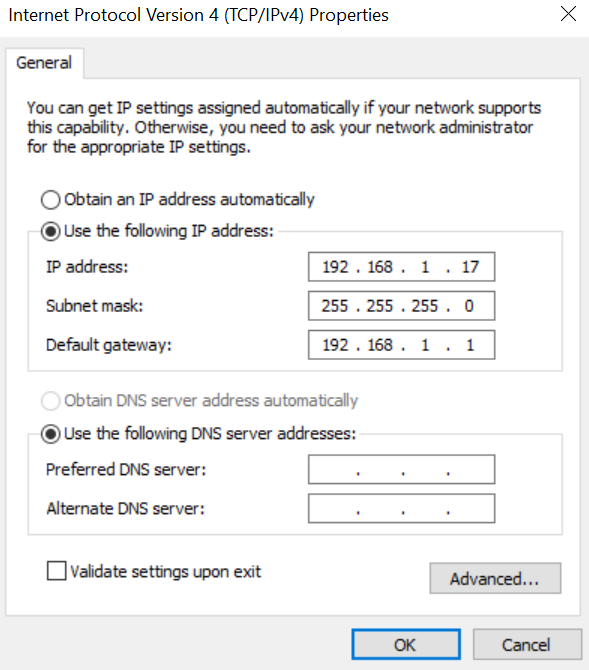
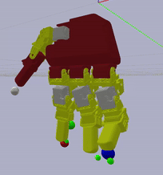

## Unofficial Python or ROS2 library for Manus Meta Gloves

While [Manus Meta](https://www.manus-meta.com/) natively supports [C++ SDK](https://docs.manus-meta.com/2.4.0/Plugins/SDK/), there is no Python or ROS2 bindings or retargeting code to robot hands such as LEAP Hand.  

This repo has tools which we use with the [LEAP Hand](https://leaphand.com/) in many projects and demos including [Bimanual Dexterity for Complex Tasks](https://bidex-teleop.github.io/)  Please see Bidex for more videos.

<p align="center">
  
</p>

The code is similar to the released [C++ SDK by Manus](https://docs.manus-meta.com/2.4.0/Plugins/SDK/), but adds [ZMQ bindings](https://github.com/zeromq/cppzmq/tree/master) to get the useful glove data in ROS2 and then a [Pybullet](https://pybullet.org/wordpress/) based [SDLS](https://mathweb.ucsd.edu/~sbuss/ResearchWeb/ikmethods/SdlsPaper.pdf) retargeter which converts this data to LEAP Hands.

This is tested on our [Quantum Mocap Metagloves](https://docs.manus-meta.com/2.4.0/Products/Quantum%20Mocap%20Metagloves/) on SDK 2.4 but should work on other Manus gloves.

# Manus SDK Setup
This sends the useful Manus data from the SDK to Python/ROS2 nodes, specifically `RawSkeletonInfo` is the fingertip data from MANUS and `Ergonomics` data is the approximate human skeleton joint angle data estimated by MANUS.

Pick EITHER [Ubuntu Standalone](https://docs.manus-meta.com/2.4.0/Plugins/SDK/Linux/) (Only an Ubuntu machine required), or with [Windows as the Core gloves server](https://docs.manus-meta.com/2.4.0/Plugins/SDK/getting%20started/) and then connect to it with a second Ubuntu client machine.

Ubuntu only is more useful for robotics, but Windows is better supported by [Manus Core](https://docs.manus-meta.com/2.4.0/Software/).

You need a license from Manus to use the SDK to use this software.
### Ubuntu Standalone 
- Follow [Manus' instructions](https://docs.manus-meta.com/2.4.0/Plugins/SDK/Linux/) and install "Core Integrated" dependencies without Docker.
- Install [cppzmq](https://github.com/zeromq/cppzmq/tree/master). (This is a dependency for our SDK version)  I recommend this guide from cppzmq:
    ```download and unzip the lib, cd to directory
    mkdir build
    cd build
    cmake ..
    sudo make -j4 install
    ```
- NOTE: The .so files are not included in Github so they must be downloaded from Manus directly via their SDK Download, use the integrated version. This library is located in the ManusSDK/lib folder of the SDK package.  Rename the libManusSDK_Integrated.so to libManusSDK.so and replace the original libManusSDK.so in the ManusSDK/lib folder.
- Instead of compiling the default sdk you download from them, compile our version but use the same instructions. (Note -lzmq has been added to the makefile that we provide) `Make (Option 1)` works well.


Now to run our version of the MANUS SDK:

- Run the [C++ (not minimal client) SDK](https://docs.manus-meta.com/2.4.0/Plugins/SDK/) with `./SDKClient_Linux.out`
- Pick standalone `1 Core Integrated` by pressing 1.
- The data should stream successfully via ZMQ. 
- Run the Python or the ROS2 script on the Linux machine.   See those sections to setup Python or ROS2.
- Check the python/ROS2 ZMQ address is `tcp://127.0.0.1:8000` (This is default) whenever you run using just one computer.

### Windows Manus Core -> Ubuntu
- Install [Manus Core 2.4](https://docs.manus-meta.com/2.4.0/Software/) and setup the gloves there
- Install the requirements from the [Manus SDK](https://docs.manus-meta.com/2.4.0/Plugins/SDK/) normally
- Download this repo and open the solution file in Visual Studio.  
- Install cppzmq.  On windows I recommend this guide from [cppzmq](https://github.com/zeromq/cppzmq/tree/master):
    - Build cppzmq via vcpkg. This does an out of source build and installs the build files
    ```git clone https://github.com/Microsoft/vcpkg.git
    cd vcpkg
    ./bootstrap-vcpkg.sh # bootstrap-vcpkg.bat for Powershell
    ./vcpkg integrate install
    ./vcpkg install cppzmq
    ```
- Set the IP address of the Windows machine in the python/ROS SDK.  I recommend you put them on the same local network and set them to two different static IPs.
    - Connect ethernet cable between the two computers
    - On the Windows machine and Ubuntu machines set the IP as the below images.
    - Make sure the Python/ROS2 file matches the IP address you select for the Windows machine and the IPs on each machine are different.  
    <p align="center">
        
         
    </p>

Now to run the SDK:

- Compile and run in Visual Studio or run the .exe that is generated (not minimal client).  Select 2 for data to come local from Core.  Otherwise make sure Manus Core is closed and then select 1 to run as SDK standalone.
- Run the Python or the ROS2 script on the Linux machine.   See the next section to setup Python or ROS2.

# Python Setup
- This directly prints the MANUS Glove data out on a Python file as an example.
- Install Python zmq by doing `pip install pyzmq`
- The glove serial numbers in the Python file should match your gloves. (Number is on Manus Core or printed by the SDK)
- To run, launch our MANUS SDK first and then run `python minimal_example.py`
- If successful the data should be printing to the terminal.
### Python + LEAP Hand
- This demo integrates MANUS gloves with the [LEAP Hand Python SDK](https://github.com/leap-hand/LEAP_Hand_API/tree/main/python).  Check the LEAP Hand for more details.
- First install LEAP Hand:
    - `pip install dynamixel_sdk numpy`
    - Copy the `leap_hand_utils` folder from the [LEAP Hand Python SDK](https://github.com/leap-hand/LEAP_Hand_API/tree/main/python) next to the LEAP_hand_example.py in this repository so that it can be imported correctly.
- Run our MANUS SDK, then connect and power your LEAP Hand and then run: `python LEAP_Hand_example.py`
- If successful, the LEAP Hand will come to life similar to our conference demo as seen on the bottom of [https://leaphand.com/](https://leaphand.com/)
- Note that this does not match the pinch grasps between the two hands but instead copies joint angles directly from the MANUS skeleton to LEAP Hand for simplicity.  The thumb will never be that good using this mode due to the differing kinematics of the two hands.

# ROS2 + LEAP Hand Retargeting Setup
It is useful to retarget the glove data to robot hands to perform similar fingertip grasping between the two hands.
- Inspired by [Robotic Telekinesis](https://robotic-telekinesis.github.io/) and [Dexcap](https://dex-cap.github.io/), this code retargets and solves for robot joint angles that matches the pinch grasps between the human and robot hands.
- This retargeter takes the Manus Glove fingertip data, runs [SDLS](https://mathweb.ucsd.edu/~sbuss/ResearchWeb/ikmethods/SdlsPaper.pdf) from [Pybullet](https://pybullet.org/wordpress/) and then returns joint angles for the robot.
- We provide examples using [LEAP Hand](https://leaphand.com/), but you can also import your own URDF/MJCF into Pybullet.
- All of these nodes are in Python so they are easy to use.

### ROS2 Setup
- If not already installed, follow [ROS2 Installation Instructions](https://docs.ros.org/en/humble/Installation/Ubuntu-Install-Debs.html) to install ROS2.
- The code we provide is two ROS2 Node/Packages:
    - `Glove` gets the glove data
    - `Telekinesis` performs the inverse kinematics
- It must live inside of a ROS2 workspace.  If you do not have an existing ROS2 Workspace then [create a workspace](https://docs.ros.org/en/humble/Tutorials/Beginner-Client-Libraries/Creating-A-Workspace/Creating-A-Workspace.html).
- Copy our two provided packages into your workspace and build the workspace.  See [ROS2 Tutorial](https://docs.ros.org/en/humble/Tutorials/Beginner-Client-Libraries/Creating-A-Workspace/Creating-A-Workspace.html) for further help and then rebuild your workspace using colcon.
- Install Python zmq by doing `pip install pyzmq`
- The glove serial numbers in the ROS2 Python node should match your gloves. (Number is on Manus Core or printed by the SDK)
- To run, launch the Manus C++ SDK first and then run the ROS2 launch file we provide called `leap_v1_ik.py` If successful Pybullet will open and you will see the LEAP Hand moving in the GUI with your hand motions.

<p align="center">
  
</p>

### ROS2 + LEAP Hand
- To run on the real [LEAP Hand](https://leaphand.com/), run our MANUS SDK first, then this ROS2 node and then the LEAP hand ROS2 node from the [LEAP Hand API](https://github.com/leap-hand/LEAP_Hand_API).

<p align="center">
  
</p>

### Extensions and Licensing
- Feel free to fork this repository and add your own robot hands.  The code is compatible with many robot hands.  You will need the URDF/MJCF of the hand available if you are using IK.
- If you find issues/bugs please feel free to open a Github Issue.
- This is based off of the Manus Meta SDK.  Our tools are released under the MIT license.  See License.md for details.

## Citing
If you find this codebase or [LEAP Hand](https://leaphand.com/) useful in your research, please cite: 

```
@inproceedings{shaw2024bimanual,
    title={Bimanual Dexterity for Complex Tasks},
    author={Shaw, Kenneth and Li, Yulong and Yang, Jiahui and Srirama, Mohan Kumar and Liu, Ray and Xiong, Haoyu and Mendonca, Russell and Pathak, Deepak},
    booktitle={8th Annual Conference on Robot Learning},
    year={2024}
}

@article{shaw2023leaphand,
	title={LEAP Hand: Low-Cost, Efficient, and Anthropomorphic Hand for Robot Learning},
	author={Shaw, Kenneth and Agarwal, Ananye and Pathak, Deepak},
	journal={Robotics: Science and Systems (RSS)},
	year={2023}
}
```

Thank you to MANUS Meta, Maarten Witteveen and Sarah Shaban for all of the help with their gloves.


<p align="center">
    <a href="https://www.manus-meta.com/">
        
    </a>
</p>


